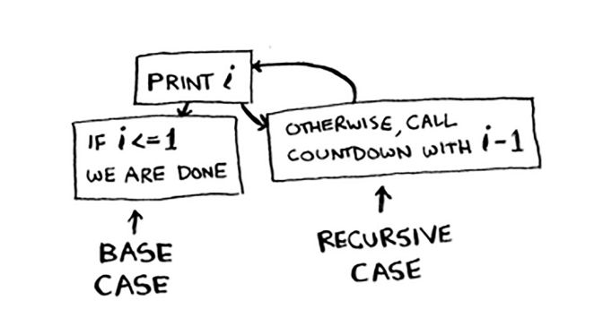

# Chapter 3 Recursion 

Every recursive function has two parts:

* Base case: It's when the function doesn't call itself again so it doesn't go into an infinite loop
* Recursive case: It's when the function calls itself

# Example
```python
def countdown(i):
    if (i < 0): #BASE CASE
        return
    print(i)
    countdown(i - 1) # RECURSIVE CASE
```



